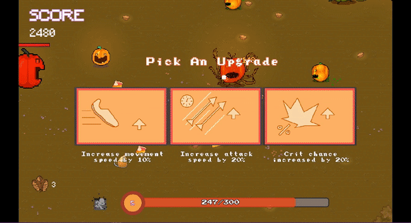
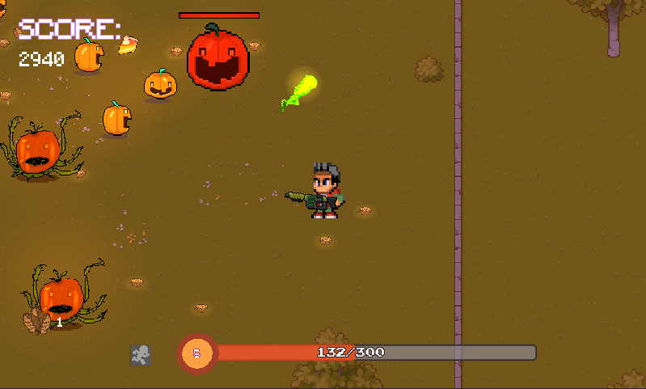
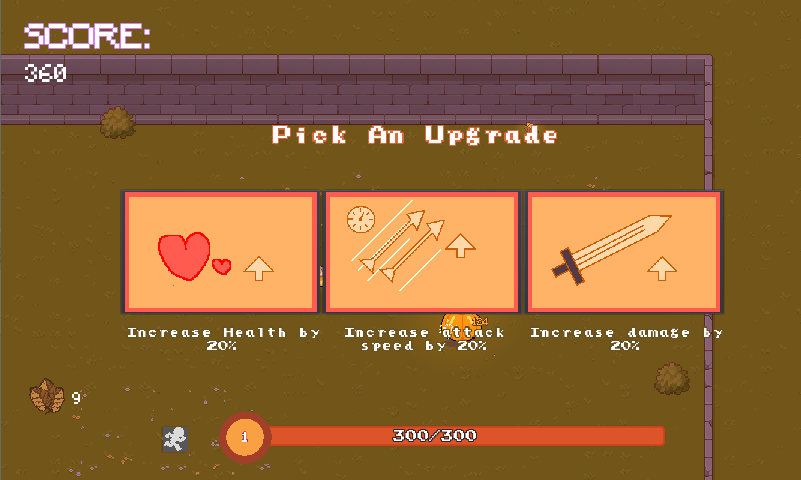

# Pumpkin Chaos

## About
This a simple game made with godot Mono. It was a submission for the [Cozy autumn game jam 2022](https://itch.io/jam/cozy-autumn-game-jam-2022)

## Introduction
The Game Is Simple,  Survive! Your Ammo Are Leaves That drop From Trees. And Evil Pumpkins Want To make A Human-smoothie Out Of You With Their Acid Shots While Others Want To Turn You Into Shish Kebab With Their Fire Shots. Destroy Them And Collect Their Sweet pumpkin Deserts To Level Up Your Stats.

## Screenshots

## Requirements
- Godot Mono 3.5
- DotNet SDK 3.3

## Contributors
- [Ezzat Eisawy](https://github.com/EzzatEsam)
- [Omar Emad](https://github.com/The-Sad-Zewalian)

## License
This project is licensed under the MIT License - see the [LICENSE](LICENSE) file for details

## Play the game
- You can clone the repo and build the game yourself
- You can play it online at [itch.io](https://ezzatesam.itch.io/pump-chaos)
